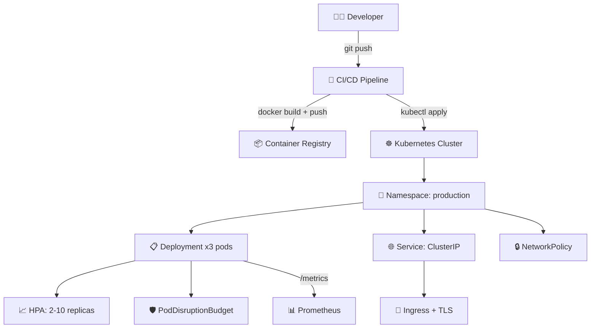

# ☸️ Advanced k8s Script Generator
> **Deploy scalable container workloads. Orchestrate deployment sets, load-balancing discovery service rules, ingress path routes, and pod autoscaling configurations dynamically in YAML manifests.**

[](https://pradeeptalari14.github.io/portfolio/tools/kubernetes/)
[]()

---

## 🎛️ Studio Options — What the UI Generates

The studio has multiple configurable options. Each combination produces different output files.
This repository contains **one working example per option variant** so you can learn by diffing.

### Output Tabs (files the studio generates)
| Tab | Description |
|-----|-------------|
| `deployment.yaml` | Generated in studio Output tab |
| `service.yaml` | Generated in studio Output tab |
| `ingress.yaml` | Generated in studio Output tab |
| `hpa.yaml` | Generated in studio Output tab |
| `Flow Diagram` | Generated in studio Output tab |

### Configurable Options
| Option | Available Values |
|--------|-----------------|
| **Workload Type** | `Deployment` / `StatefulSet` / `DaemonSet` |
| **Cloud Provider** | `AWS EKS` / `GCP GKE` / `Azure AKS` |
| **Service Type** | `ClusterIP` / `NodePort` / `LoadBalancer` |
| **Ingress** | `enabled` / `disabled` |
| **HPA** | `enabled` / `disabled` |
| **RBAC** | `enabled` / `disabled` |
| **NetworkPolicy** | `enabled` / `disabled` |
| **Security Hardening** | `enabled` / `disabled` |

---

## 🏗️ Architecture Flow Diagram



---

## 📁 Repository Structure

```
tp-kubernetes/
├── README.md          ← This file — complete learning guide
├── examples/deployment/deployment.yaml
├── examples/statefulset/statefulset.yaml
├── examples/daemonset/daemonset.yaml
├── examples/networking/service.yaml
├── examples/networking/ingress.yaml
├── examples/scaling/hpa.yaml
├── examples/security/rbac.yaml
├── examples/security/network-policy.yaml
├── examples/resilience/pdb.yaml
├── scripts/deploy.sh
├── scripts/           ← Deployment + validation helpers
└── docs/USAGE.md      ← Extended usage guide
```

---

## ⚡ Quick Start

### Step 1 — Generate files from the Studio
1. Open **[Advanced k8s Script Generator Studio](https://pradeeptalari14.github.io/portfolio/tools/kubernetes/)**
2. Select your option values in the UI
3. Watch the output update live in the editor
4. Click **Download** or **Copy** for each tab

### Step 2 — Use the example files in this repo
```bash
git clone https://github.com/Pradeeptalari14/tp-kubernetes.git
cd tp-kubernetes
# Browse examples/ to find the variant matching your needs
# Copy the relevant files into your project
```

---

## 🔄 Complete Start-to-End Workflow


---

## 📖 How Each Option Changes the Output

### Workload Type
- **`Deployment`** — see `examples/` folder for generated output
- **`StatefulSet`** — see `examples/` folder for generated output
- **`DaemonSet`** — see `examples/` folder for generated output

### Cloud Provider
- **`AWS EKS`** — see `examples/` folder for generated output
- **`GCP GKE`** — see `examples/` folder for generated output
- **`Azure AKS`** — see `examples/` folder for generated output

### Service Type
- **`ClusterIP`** — see `examples/` folder for generated output
- **`NodePort`** — see `examples/` folder for generated output
- **`LoadBalancer`** — see `examples/` folder for generated output

### Ingress
- **`enabled`** — see `examples/` folder for generated output
- **`disabled`** — see `examples/` folder for generated output

### HPA
- **`enabled`** — see `examples/` folder for generated output
- **`disabled`** — see `examples/` folder for generated output

### RBAC
- **`enabled`** — see `examples/` folder for generated output
- **`disabled`** — see `examples/` folder for generated output

### NetworkPolicy
- **`enabled`** — see `examples/` folder for generated output
- **`disabled`** — see `examples/` folder for generated output

### Security Hardening
- **`enabled`** — see `examples/` folder for generated output
- **`disabled`** — see `examples/` folder for generated output

---

## 🔐 Security Best Practices

- ❌ Never commit credentials, API keys, or passwords
- ✅ Use environment variables or secret managers (Vault, AWS SSM, GitHub Secrets)
- ✅ Enable branch protection: require PR reviews + CI status checks
- ✅ Rotate credentials regularly and use least-privilege

---

## 📖 Resources

| Resource | Link |
|----------|------|
| Interactive Studio | [Open →](https://pradeeptalari14.github.io/portfolio/tools/kubernetes/) |
| All 91 Studios | [Dashboard →](https://pradeeptalari14.github.io/portfolio/tools/) |
| SRE Provisioning Guide | [Handbook →](https://github.com/Pradeeptalari14/portfolio/blob/main/GITHUB_PROVISIONING_GUIDE.md) |

---
*Generated by [Advanced k8s Script Generator Studio](https://pradeeptalari14.github.io/portfolio/tools/kubernetes/) — [Talari Pradeep Portfolio](https://pradeeptalari14.github.io/portfolio)*